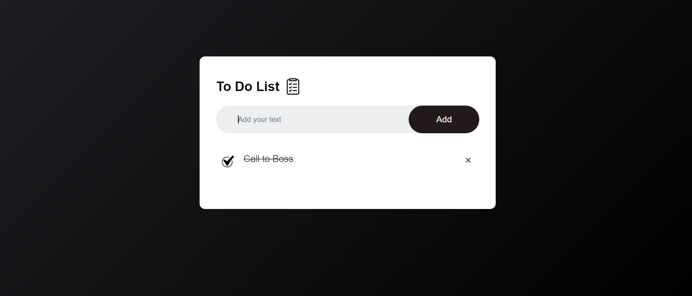

# ToDo App



## Description

ToDo App is a simple web application that allows users to add, complete, and delete tasks effortlessly, 
keeping their day organized and boosting productivity. This project was created using HTML, CSS, and JavaScript, 
making it a great showcase of front-end development skills.

## Features

- Add new tasks with a user-friendly input box.
- Mark tasks as completed to track your progress.
- Delete tasks you no longer need with a single click.
- Data persistence through local storage to retain tasks across sessions.

## Demo

Try out the app here: [Live Demo](https://adwebtechnology.com/weather/ToDoListApp.html)

## Installation

1. Clone the repository:

```bash
git clone https://github.com/your-username/todo-app.git
cd todo-app


Sure! Below is a sample README.md file for your GitHub repository for the ToDo app. This README will provide essential information about the project, how to use the app, and how to set it up locally.

markdown
Copy code
# ToDo App


## Description

ToDo App is a simple web application that allows users to add, complete, and delete tasks effortlessly, keeping their day organized and boosting productivity. This project was created using HTML, CSS, and JavaScript, making it a great showcase of front-end development skills.

## Features

- Add new tasks with a user-friendly input box.
- Mark tasks as completed to track your progress.
- Delete tasks you no longer need with a single click.
- Data persistence through local storage to retain tasks across sessions.

## Demo

Try out the app here: [Live Demo](https://your-todo-app-url.com)

## Installation

1. Clone the repository:

```bash
git clone https://github.com/your-username/todo-app.git
cd todo-app
Open index.html in your web browser.
Usage
To add a new task, type the task description in the input box and press Enter or click the "Add" button.
To mark a task as completed, click on the task text. Click again to unmark it.
To delete a task, click on the "x" symbol next to the task text.
Contributing
Contributions are welcome! If you find any bugs or have suggestions for improvements, please open an issue or submit a pull request. Follow these steps to contribute:

Acknowledgments
The app developement is inspired by Chhote Lal Jatav's .
GreatStack for https://www.youtube.com/@GreatStackDev.

